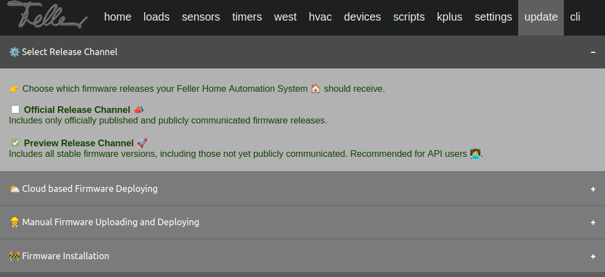

# 📄 Wiser-by-Feller RESTFul OpenAPI

## 🛠️ Introduction

The [µGW Rest API documentation](https://feller-ag.github.io/wiser-api)  provides a comprehensive guide for using the µGW through various endpoints and functions.
If anything is unclear 🤔 or you can't find something in the documentation 📖, don’t hesitate. Just go ahead and create an **Issue** 📝 with your question! 🚀😊

## 🌀 Preview Releases

Stay Ahead with Preview Releases for Your Home Automation Projects.

We’re thrilled to give our community and developers a new way to innovate faster with Preview releases.

- 🎉 Get early access to the latest features, improvements, and updates without waiting for the next fixed release cycle.
- ⏩ Our production software will keep its stable schedule, but if you love living on the edge and exploring what’s next, preview releases are your VIP ticket to the future.

### 🔄 What are Preview Releases?

Preview releases allow developers to access the most current version of our software as soon as it becomes available.
This means you can experiment with new features, improvements and bug fixes without waiting for the next scheduled release.

### 🌟 Benefits of Preview Releases

- Immediate Access: Get the latest features and improvements as soon as they are ready.
- Active Participation: Engage with the development process by providing feedback on new features.
- Stay Updated: Keep your projects aligned with the latest advancements in our IoT application.

We encourage all developers interested in preview releases to subscribe and join us in shaping the future of our software. Your feedback is invaluable, and we look forward to collaborating with you! 🤝

### ✉️ Request firmware-version for Preview Releases

To activate the new feature for select release-channels, send an [eMail](mailto:partner.api@feller.ch?subject=Request%20uGateway%20Preview%20Release&body=Hi%0AI%20love%20Wiser-by-Feller%20and%20I’m%20living%20on%20the%20edge!%0A%0APlease%20update%20my%20Wiser-by-Feller%20Gateway%20with%20the%20ID%20wiser-[00XXXXXX]%20the%20latest%20firmware-version%20so%20I%20can%20select%20the%20preview-release-channel.%0A%0ACheers%20%0A[Your%20Name]) to request the latest firmware-version.

After activation of the latest firmware-version, its possible to select release-channels e.g. **[Preview Release Channel 🚀]** per µGW WebSite.

## 📦 Versions of the µGW Rest API

- **Version 5.x**: 📟 This version is designed for the µGWv1.
- **Version 6.x**: 🚀 This version is designed for the new µGWv2. It is backward compatible with version 5.1 but offers additional services and functions.

Check out the [changelog](./CHANGELOG.md)!

## 🔍 Identification of µGW Devices

The distinction between µGWv1 and µGWv2 is made based on the article number:

- **Article number of µGWv1**: The index contains an "**A**".
  - 🅰️ Example: 926-3401.1.W.**A**.F.61
- **Article number of µGWv2**: The index contains a "**B**".
  - 🅱️ Example: 926-3401.1.W.**B**.F.61

## 🚀 Awesome Projects

✨ These incredible projects demonstrate creative and powerful integrations of our API.  
Check them out and get inspired! 🚀🔧

### Homebridge

- [hansfriedrich/homebridge-feller-wiser (GitHub) 🔗](https://github.com/hansfriedrich/homebridge-feller-wiser)

### ioBroker

- [ice987987/ioBroker.wiserbyfeller (GitHub) 🔗](https://github.com/ice987987/ioBroker.wiserbyfeller)

### Matter

- [rolfscherer/wiser-matter-bridge (GitHub) 🔗](https://github.com/rolfscherer/wiser-matter-bridge)

### plan44 matter+DS gateway

- [plan44/vdcd automation daemon (github) 🔗](https://github.com/plan44/vdcd)
- [plan44/p44mbrd matter bridge (github) 🔗](https://github.com/plan44/p44mbrd)

### Python

- [Syonix/aioWiserByFeller (GitHub) 🔗](https://github.com/Syonix/aioWiserByFeller)

### Home Assistant

- [Syonix/ha-wiser-by-feller (GitHub) 🔗](https://github.com/Syonix/ha-wiser-by-feller)
- [machgo/fellerwiserhomeassistant (GitHub) 🔗](https://github.com/machgo/fellerwiserhomeassistant)

❓ Haven't we heard about your project yet? Let us know! 📩  
There's always space for more amazing ideas! 😊🎊🚀
